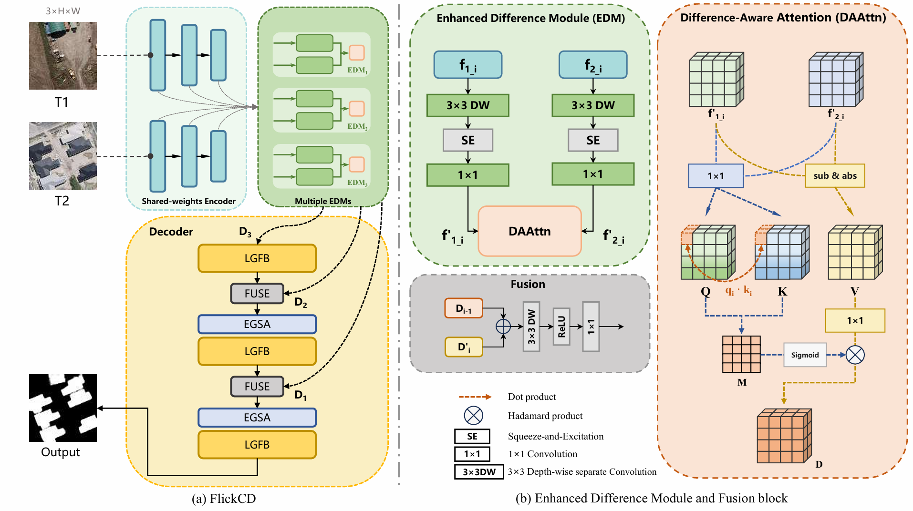
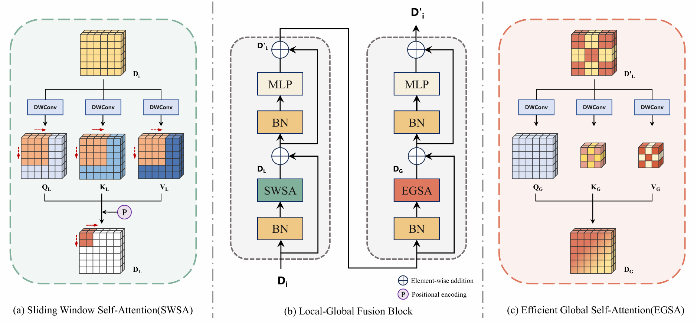

<div align="center">
<h1 align="center">FlickCD</h1>

<h3>PushingTrade-Off Boundaries:Compact yet Effective Remote Sensing Change Detection</h3>
</div>

## Overview

* **FlickCD** adopts an encoder-decoder architecture, where a Siamese structure is used to process the bi-temporal images. The extracted features are then passed through the Enhanced Difference Module (EDM) to capture change-related information, followed by a lightweight decoder that further analyzes and refines the difference features, ultimately generating a binary change map.

<p align="center">
  
</p>

* Architectural Diagram of the Local-Global Fusion Block (LGFB)

<p align="center">
  
</p>

## Get Started
### Environment Setup:
**Create and activate a new conda environment**
```
conda create -n flickCD python=3.8
conda activate flickCD
pip install -r requirements.txt
```

### Data preparation
We conduct experiments on four datasets: **SYSU**, **WHU**, **LEVIR+**, and **CDD**. The data for each dataset is organized in the following structure:
```
├── /Dataset/SYSU(or WHU,LEVIR+,CDD) 
    ├── train
    │   ├── T1
    │   │   ├──00001.png
    │   │   ├──00002.png
    │   │   ...
    │   │
    │   ├── T2
    │   │   ... 
    │   │
    │   └── GT
    │       ...   
    │   
    ├── val
    │   ├── ...
    |
    ├── test
    │   ├── ...
    │  
    ├── train.txt   # Data name list
    ├── val.txt     
    └── test.txt    
```

### Model Training
First, set the data path, number of training epochs, learning rate, and other basic parameters in the `trainAndtest.sh` script. For more advanced configuration options, please modify the `train.py` file directly.
Then, run the following command to start training:
```
sh trainAndtest.sh
```
After training is complete, a result folder will be generated in the current directory.
It includes:
* A log file that records the training process
* The best-performing model weights saved as a .pth file
* A checkpoint file ckpt.pth.tar for resuming interrupted training sessions

